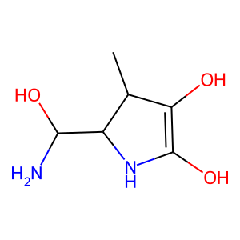

# Molecular Graph Diffusion (WIP)

This JAX/Flax (linen) project implements a diffusion-based generative framework for molecular graphs, with a focus on the QM9 dataset. The codebase is a research sandbox to investigate the prospects of continuous relaxation of discrete graphs and study how representation choice (logits vs latents) affects stability, validity, and controllability via latent-space guidance in molecular diffusion models. Essentially, this aims at a unified diffusion framework that can naturally handle both discrete molecular structure and continuous attributes within a single generative process.

The current default is Continuous Diffusion for Categorical Data (CDCD): categorical node/edge types are embedded into a continuous hypersphere space, the backbone predicts logits, and the denoised latent is reconstructed as the probability-weighted embedding average. Sampling uses an EDM-style reverse process, with symmetry enforced on the latent state (x0, xσ, xt) and symmetric noise. Logits are not symmetrised. This continuous relaxation lets us apply smooth guidance terms (e.g., expected valence) directly in the denoising process.

Legacy interfaces for logit-level diffusion and autoencoder-based latent diffusion are still present but considered phased out (see the Legacy section below). Contrary to the legacy logic, aromaticity bond hints are no longer outputted, relying uniquely on kekulisation.

## Related work

This approach combines ideas from continuous-time diffusion models (EDM), discrete graph diffusion, and molecular generative modeling. CDCD can be seen as a continuous relaxation of categorical diffusion, where the network predicts logits over discrete types while diffusion proceeds in a continuous embedding space. It is also aligned with DiGress-style modeling choices (kekulized bonds, explicit size conditioning if desired), except for a notable difference: the use of explicit hydrogens, enabling mixed discrete–continuous modelling and soft constraint guidance at the atomic level.

## Setup
Create a virtualenv, install dependencies, and install the package in editable mode:
```bash
python3 -m venv .venv && source .venv/bin/activate
pip install -r requirements.txt
pip install -e .
```

## CDCD diffusion (current)

First download QM9, process molecules into dense adjacency format, and create training-test splits:
```bash
python data/download_qm9.py --output data/raw
python3 scripts/preprocess_qm9.py --input data/raw/gdb9.sdf --output data/processed/qm9_dense.npz --dtype float32 --kekulize
python3 scripts/create_splits.py --num_samples 131970 --train_ratio 0.8 --val_ratio 0.1 --test_ratio 0.1 --output data/processed/qm9_splits.npz --seed 42
```

This showcases the interface to train a diffusion model operating in CDCD mode:
```python
import jax, numpy as np
from mgd.dataset import GraphBatchLoader
from mgd.latent import GraphLatentSpace
from mgd.model import CategoricalLatentEmbedder
from mgd.training import CategoricalDiffusionSpace
from mgd.dataset.qm9 import BOND_VOCAB_SIZE, ATOM_VOCAB_SIZE

# Data
batch_size = 64
splits = dict(np.load("../data/processed/qm9_splits.npz"))
data = dict(np.load("../data/processed/qm9_dense.npz"))
train_loader = GraphBatchLoader(data, indices=splits["train"], batch_size=batch_size, key=jax.random.PRNGKey(0))

# Model
# Latent space: captures its dimensionality and methods to produce 
# random latents. Similar in spirit to NetKet's `hilbert`
space = GraphLatentSpace(node_dim=128, edge_dim=128)
embedder = CategoricalLatentEmbedder(
    space=space,
    node_vocab=ATOM_VOCAB_SIZE,
    edge_vocab=BOND_VOCAB_SIZE,
)
# Type of latent space: captures the type of diffusion (logit, latent, 
# CDCD) and the associated loss. Useful when trying experimental 
# diffusion schemes
diff_space = CategoricalDiffusionSpace()
```

```python
from mgd.model import MPNNDenoiser, TransformerDenoiser
from mgd.model import GraphDiffusionModel
from mgd.training import create_train_state
from mgd.training import train_loop
from mgd.diffusion import sample_sigma_mixture
from mgd.utils import Logger

from pathlib import Path
from functools import partial
import optax

def make_lr_schedule():
    return optax.warmup_cosine_decay_schedule(
        init_value=0.0,
        peak_value=1e-3,
        warmup_steps=1_000,
        decay_steps=5_000,
        end_value=1e-4,
    )

# Hyperparameters
lr = 5e-4
mess_dim = 256 // 2  # Message dimension
time_dim = 256 // 2  # log(sigma) embedding dimension 
node_count_dim = 256 // 2  # Molecule-size embedding dimension
n_layers = 4
rho = 7.0
num_steps = 40

# Sigma scales from latent stats (masked RMS from data)
sigma_data_node = 1.0  # Should be adapted to the data's sigma
sigma_data_edge = 1.0  # Should be adapted to the data's sigma
sigma_max = 8.0 * max(sigma_data_node, sigma_data_edge)
sigma_min = 0.005 * max(sigma_data_node, sigma_data_edge)

# Build model
# Backbone (MPNN or Transformer)
denoiser = MPNNDenoiser(
    node_vocab=ATOM_VOCAB_SIZE,
    edge_vocab=BOND_VOCAB_SIZE,
    mess_dim=mess_dim,
    time_dim=time_dim,   # log(sigma)
    node_count_dim=node_count_dim,
    n_layers=n_layers,
)
# Alternatively, use a Transformer backbone:
# denoiser = TransformerDenoiser(
#     node_dim=space.node_dim,
#     edge_dim=space.edge_dim,
#     node_vocab=ATOM_VOCAB_SIZE,
#     edge_vocab=BOND_VOCAB_SIZE,
#     time_dim=time_dim,
#     node_count_dim=node_count_dim,
#     n_layers=n_layers,
#     n_heads=8,
# )
# Diffusion model
diff_model = GraphDiffusionModel(
    denoiser=denoiser,
    embedder=embedder,
    sigma_data_node=sigma_data_node,
    sigma_data_edge=sigma_data_edge,
    sigma_min=sigma_min,
    sigma_max=sigma_max,
)

rng = jax.random.PRNGKey(0)
batch = next(iter(train_loader))  # dummy batch
tx = optax.chain(
    optax.clip_by_global_norm(1.0),
    optax.adam(learning_rate=make_lr_schedule()),
)

# Add additional sampling weight at low sigma (optional)
sigma_sampler = partial(sample_sigma_mixture, p_low=0.3, k=3.0)

diff_state = create_train_state(
    diff_model,
    batch,  # Necessary to initialise the model's weights
    tx,
    rng,
    space=diff_space,
    sigma_sampler=sigma_sampler,
)

# Logger/checkpoint setup
ckpt_dir = Path(f"../checkpoints/diffusion_cdcd_smin0p005_{n_layers}layer").resolve()
logger = Logger(log_every=10, ckpt_dir=ckpt_dir, ckpt_every=1000)

# Train
diff_state, history = train_loop(
    diff_state,
    train_loader,
    n_steps=3_000,
    rng=jax.random.PRNGKey(1),
    logger=logger,
)

# import matplotlib.pyplot as plt

# plt.plot([h['loss'] for h in logger.data])
# plt.plot([h['edge_loss'] for h in logger.data])
# plt.plot([h['node_loss'] for h in logger.data])
# plt.ylim(0, 5)

print("Last metrics:", history[-1] if history else logger.data[-1])
```
```python-repl
100%|██████████| 3000/3000 [1:04:45<00:00,  1.30s/it, edge_loss=0.0041, loss=0.0154, node_loss=0.0113, sigma_mean=1.0564]
Last metrics: {'edge_loss': Array(0.00385095, dtype=float32), 'loss': Array(0.01907935, dtype=float32), 'node_loss': Array(0.0152284, dtype=float32), 'sigma_mean': Array(1.1326635, dtype=float32)}
```

Once the diffusion model is trained, sampling is performed as follows:
```python
import jax.numpy as jnp
from mgd.dataset.qm9 import MAX_NODES
from mgd.training import compute_occupation_log_weights
from mgd.sampling import LatentSampler, HeunUpdater, LogitGuidanceConfig, make_logit_guidance
from mgd.sampling.sampler import _prepare_masks
from mgd.diffusion import make_sigma_schedule

# Config
batch_size = 1024
max_atoms = MAX_NODES
rng = jax.random.PRNGKey(0)

# Generate random molecule sizes (n_atoms) for each element of the batch with the
# same statistics as the dataset
occup_log_weights = compute_occupation_log_weights(train_loader, MAX_NODES, max_batches=1024)
rng, rng_size = jax.random.split(rng)
n_atoms = jax.random.categorical(rng_size, occup_log_weights, shape=(batch_size,))
_, _, node_mask, pair_mask = _prepare_masks(n_atoms, batch_size, space.dtype, None, None, max_atoms=MAX_NODES)

# Prepare sampler
sampler = LatentSampler(space=space, state=diff_state, updater=HeunUpdater())

# Soft guidance (optional). Default guidance differentiates through the denoiser
# to obtain ∇x E(pθ(x,σ)); an experimental cheap mode can guide via symmetrised
# probabilities without backprop through the model.
guidance_cfg = LogitGuidanceConfig(valence_weight=1.0)
guidance_fn = make_logit_guidance(
    guidance_cfg,
    weight_fn=lambda s: 10.0 * (1.0 - s / diff_state.model.sigma_max),
)

# Build sigma schedule
sigma_sched = make_sigma_schedule(
    diff_state.model.sigma_min,
    diff_state.model.sigma_max,
    rho=rho,
    num_steps=num_steps,
)

# Sample latent embeddings
rng, sample_rng = jax.random.split(rng)
latents = sampler.sample(
    sample_rng,
    sigma_schedule=sigma_sched,
    batch_size=batch_size,
    n_atoms=n_atoms,
    node_mask=node_mask,
    pair_mask=pair_mask,
    max_atoms=max_atoms,
    guidance_fn=guidance_fn,
)

# Get logits at sigma_min and decode to discrete types (TODO: improve interface)
sigma0 = jnp.full((batch_size,), diff_state.model.sigma_min, dtype=latents.node.dtype)
pred = diff_state.denoise(latents, sigma0, node_mask=node_mask, pair_mask=pair_mask)
logits = pred["logits"]
edge_logits = logits.edge
```

Edge logits are factorised as an existence logit (index `0`) plus conditional type logits (indices `1:`). Type CE is applied only when a bond exists. Upon argmax decoding atom types, bonds can be decoded through a two-pass greedy algorithm:
```python
from rdkit import Chem
from rdkit.Chem import Draw
from mgd.eval import decode_greedy_valence_batch, build_molecule_and_check

atom_pred = jnp.argmax(logits.node, axis=-1)

bond_pred = decode_greedy_valence_batch(
    edge_logits,
    atom_pred,
    node_mask,
    pair_mask,
)

mols = []
for i in range(batch_size):
    valid, result = build_molecule_and_check(atom_pred[i], bond_pred[i], node_mask[i])
    if valid:
        mols.append(result)
    else:
        print("Invalid molecule:", result)
print("n_valid / n_molecules = ", len(mols) / batch_size)
```
```python-repl
[22:02:32] Explicit valence for atom # 11 H, 2, is greater than permitted
Invalid molecule:  [H]OC1=C(O[H])C([H])(C([H])([H])[H])C([H])(C([H])(O[H])N([H])[H])N1[H]
n_valid / n_molecules =  0.984375
```

We may plot some molecule and perform some minimal checks beyond RDKit validity:
```python
# pick a molecule of decent size
mol = mols[12]

Draw.MolToImage(mol)
```


```python
from rdkit.Chem import AllChem

mol = Chem.AddHs(mol)

params = AllChem.ETKDGv3()
params.randomSeed = 0

# minimal checks on geometry
ok = AllChem.EmbedMolecule(mol, params)
if ok != 0:
    raise RuntimeError("3D embedding failed")

# minimal checks on energy
mmff_props = AllChem.MMFFGetMoleculeProperties(mol, mmffVariant="MMFF94")
if mmff_props is None:
    raise RuntimeError("MMFF parameters unavailable")
ff = AllChem.MMFFGetMoleculeForceField(mol, mmff_props)
energy = ff.CalcEnergy()

print("MMFF energy:", energy)

res = AllChem.MMFFOptimizeMolecule(
    mol,
    maxIters=200,
    nonBondedThresh=100.0,
)
print("MMFFOptimizeMolecule return:", res)

heavy = mol.GetNumHeavyAtoms()
print("E / heavy atom:", energy / heavy)
```
```python-repl
MMFF energy: -16.104065409920615
MMFFOptimizeMolecule return: 0
E / heavy atom: -1.4640059463564195
```
Seems reasonable! :)

## Roadmap

- Mixed discrete–continuous molecular generation. In particular, joint graph–geometry diffusion (structure + 3D coordinates).
- Transformer backbone experiments with scaling and conditioning; MPNN remains supported.
- Extend soft guided sampling to additional chemical and physical constraints.
- Factorised bond decoding: separate bond existence from bond type.
- Scaffold-conditioned generation (partial graph conditioning).
- Two-step greedy decoding:
    1. Kruskal-style decoding on scaffold atoms.
    2. Valence-constrained greedy completion.
- Merge local sharding and parallelism logic.

## Legacy interfaces (phased out)

The following APIs are still present but no longer the default path:
- Logit-level diffusion via `OneHotLogitDiffusionSpace`. Similar to the above but where diffusion happens directly in logit space, without any form of learnt embedding.
- Autoencoder latent diffusion (`OneHotAutoencoder` and related training utilities). This involves an extra step, where an autoencoder is trained as to produce smooth latents in a space of desired dimension. The decoder decodes these latents into a set of logits. In particular, for bonds, we predict one extra logit that determines the probability of existence of a bond of any type between any two atoms; this masks the bond-type predictions made from the usual logits.
This procedure generically leads to the collapse of the latent space into a sharp low-dimensional manifold that breaks diffusion. To mitigate it, the autoencoder is trained under strong noise injection at the latent level. In practice, the magnitude of the noise is chosen as large as possible while ensuring that the trained denoising autoencoder is able to achieve perfect F1 scores for both atom and bond types. Early stopping is also enforced with the same condition.
